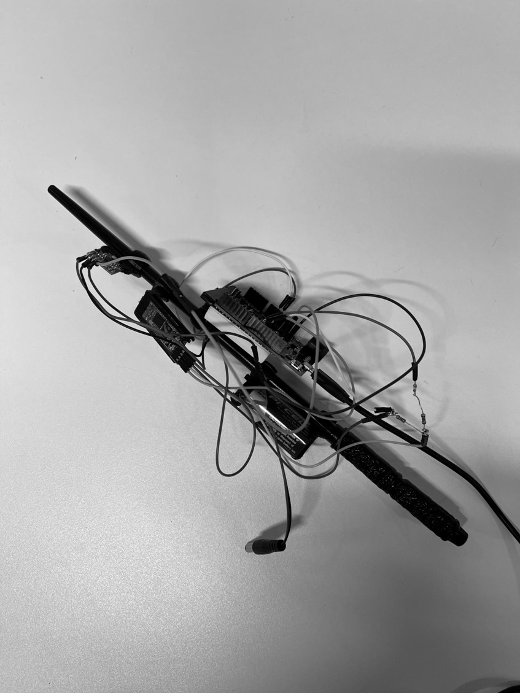

# InfiniteWand
InfiniteWand is an ongoing project aimed at enhancing interaction through a cyber wand, primarily utilizing coding with Arduino IDE and machine learning.

Code in this project can help you training your own motion model for this wand.
